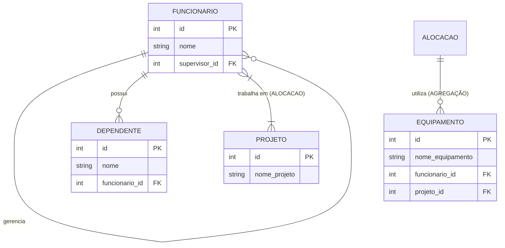

# Projeto BD Agregação

Projeto desenvolvido para demonstrar:

- Dependência de existência
- Autorelacionamento
- Agregação em banco de dados PostgreSQL

## Diagrama

```mermaid
erDiagram
    FUNCIONARIO ||--o{ FUNCIONARIO : "gerencia"
    FUNCIONARIO ||--o{ DEPENDENTE : "possui"
    FUNCIONARIO }|--|{ PROJETO : "trabalha em (ALOCACAO)"
    ALOCACAO ||--o{ EQUIPAMENTO : "utiliza (AGREGAÇÃO)"

    FUNCIONARIO {
        int id PK
        string nome
        int supervisor_id FK
    }

    DEPENDENTE {
        int id PK
        string nome
        int funcionario_id FK
    }

    PROJETO {
        int id PK
        string nome_projeto
    }

    EQUIPAMENTO {
        int id PK
        string nome_equipamento
        int funcionario_id FK
        int projeto_id FK
    }
```